# About KEYTRIS

- 게임으로 배우는 오늘의 기사 키워드 KEYTRIS
- 단어 유사도를 활용해 오늘의 기사 키워드를 익히는 웹소켓 게임 서비스
- 개발 기간: 2023.08.14~2023.10.06

 

# Description

- KEYTRIS는 Keyword + Tetris의 합성어로 단어 유사도를 활용하여 오늘의 기사 키워드를 재미있게 배울 수 있는 게임입니다.
- 타겟어와 유사한 단어를 입력하여 화면에 쌓이는 단어 블럭을 없애고 점수를 획득할 수 있습니다.
- 싱글 모드 일일 랭킹 시스템을 제공하여 다른 플레이어와 경쟁하고 랭킹을 갱신하는 즐거움을 느낄 수 있습니다.
- 멀티 모드를 통해 친구들과 함께 게임을 즐길 수 있습니다.
- 뉴스 카테고리별로 매일 새로운 단어를 익히고, 게임에 등장한 타겟어가 포함된 기사를 확인할 수 있습니다.

 

# Game Rules

1. 연두색 타겟어와 맥락이 유사한 새로운 단어를 입력해주세요.

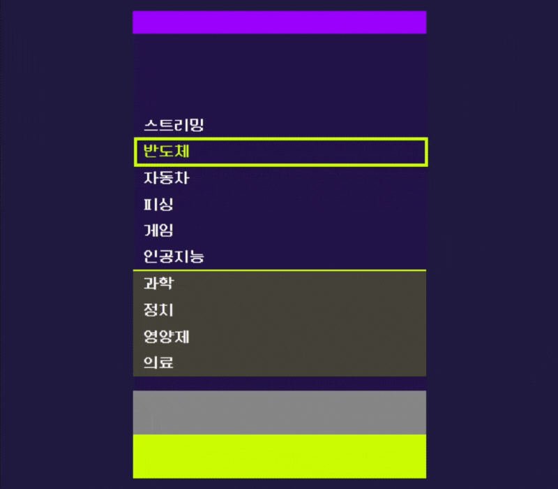

2. 화면의 단어들이 입력 단어와 가장 유사한 순으로 정렬됩니다.

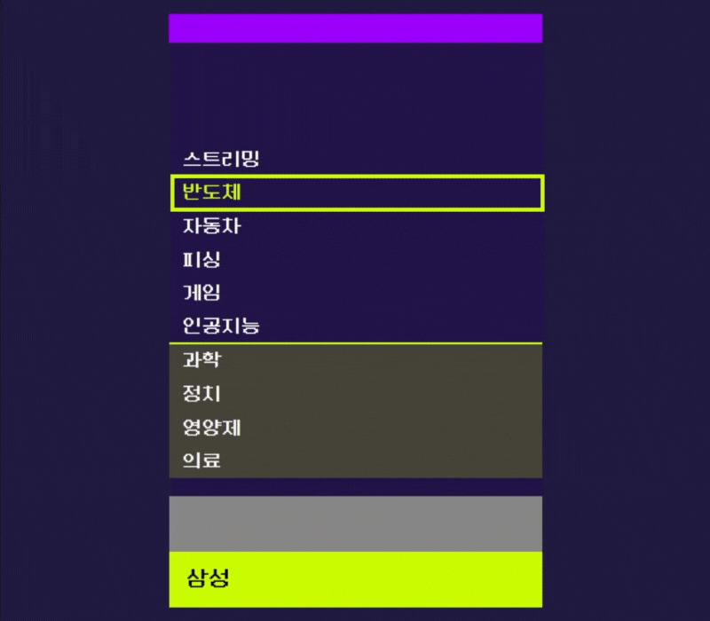

3. 타겟어가 4위 이내에 들어오면 단어가 제거되고 점수를 얻을 수 있어요.

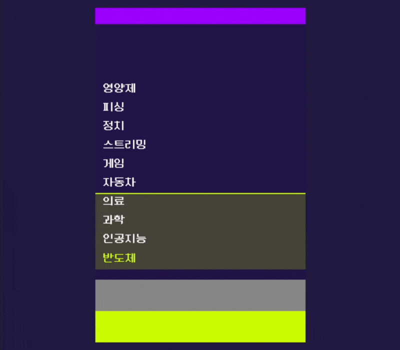

4. 3초마다 새로운 단어가 화면에 추가됩니다. 최상단까지 단어가 쌓이면 게임이 종료되니, 빠르게 단어를 제거해보세요.

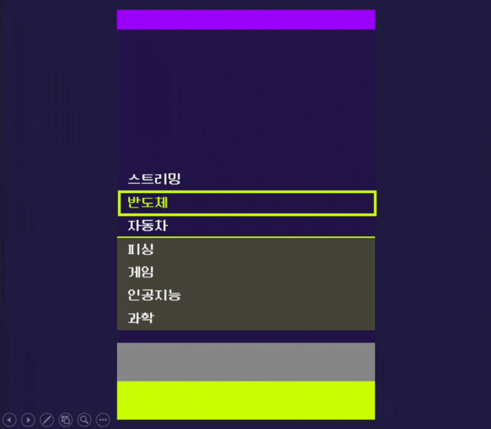

 

# Screens

## 1. 게임 시작

### 1인 모드, 친구 모드 선택 가능

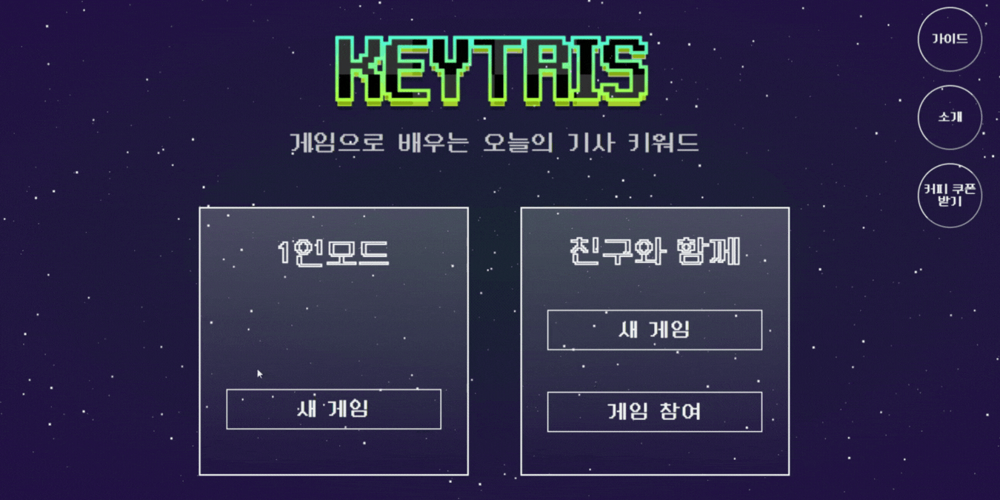

### 뉴스 카테고리 선택

- 알고 싶은 기사 카테고리를 선택하는 기능 (정치, 경제, 사회, 생활/문화, 세계, IT/과학)

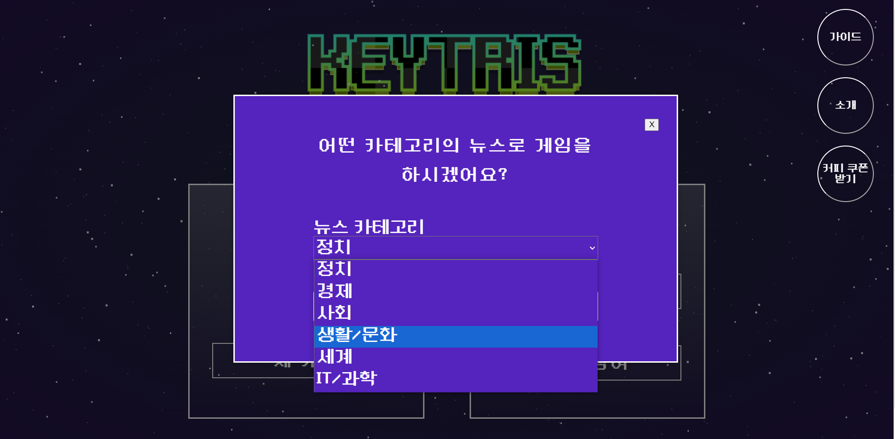

## 2. 1인 모드 게임

### 매일 새로운 기사에서 추출된 단어로 1인 게임 가능

- 3초마다 새로운 단어 추가
- 게임 난이도 조절을 위해 입력 제한 단어 설정

### 일일 랭킹 시스템

- 1인 모드 일일 랭킹 조회 기능
- 내 점수가 순위권인 경우 내 점수를 랭킹 보드에 저장하는 기능

### 오늘의 기사 확인 기능

- 게임의 마지막 타겟어가 포함된 오늘의 기사를 확인할 수 있는 기능
- 링크 클릭 시 해당 기사 조회 가능

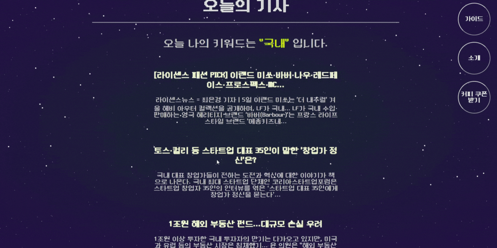

## 3. 친구 모드 게임

### 최대 4명이 함께 게임 가능

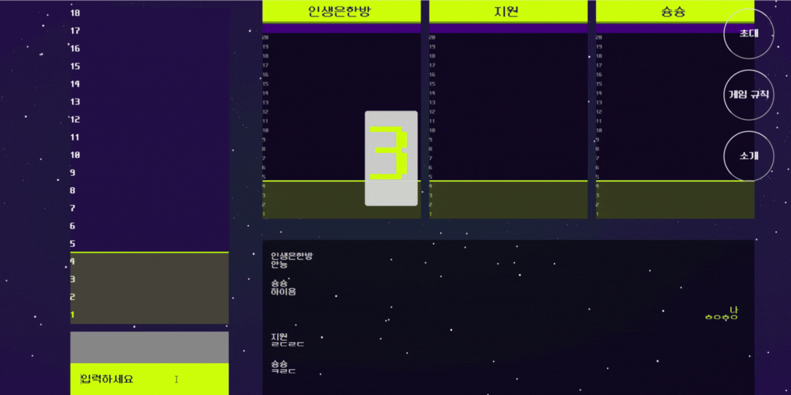

### 친구 모드 게임 만들기

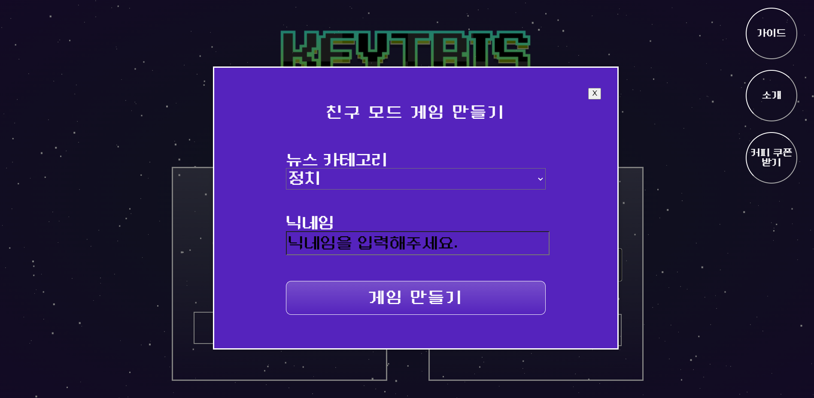

### 게임 초대하기

- 게임 코드를 복사하여 친구 초대

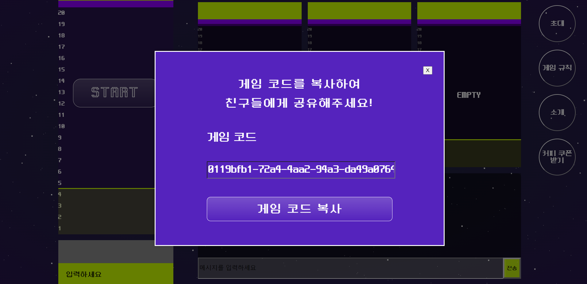

### 게임 입장하기

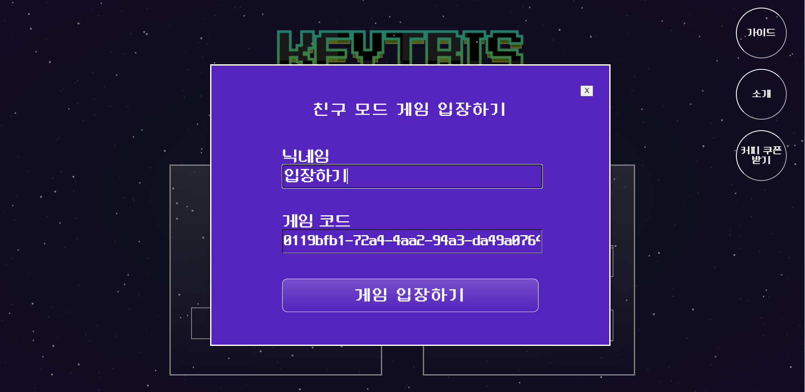

### 채팅

- 참여자 입장 알림, 참여자 간 채팅 기능

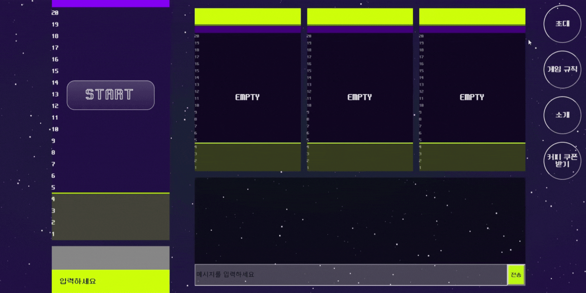

### 참여자 순위 확인

- 함께한 플레이어, 나의 순위 확인 가능

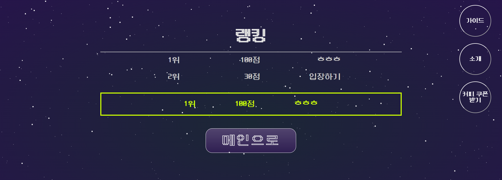
