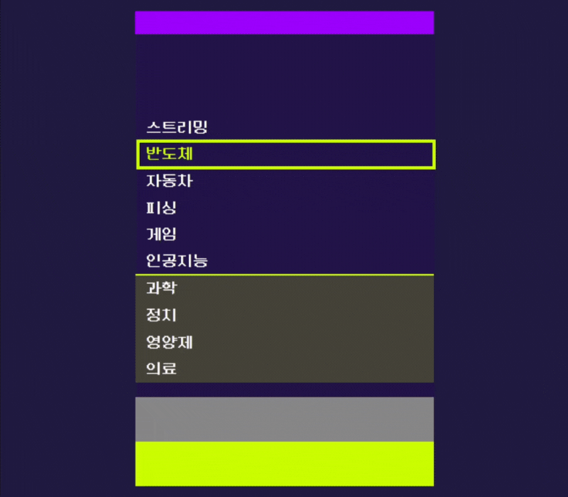
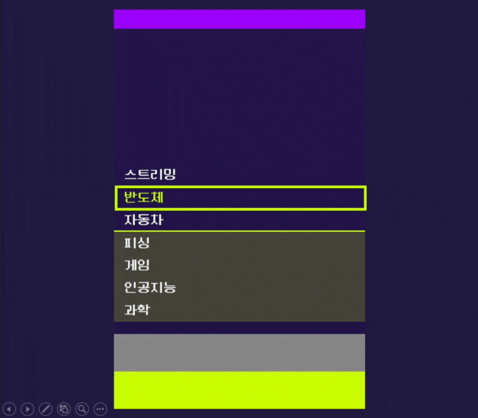
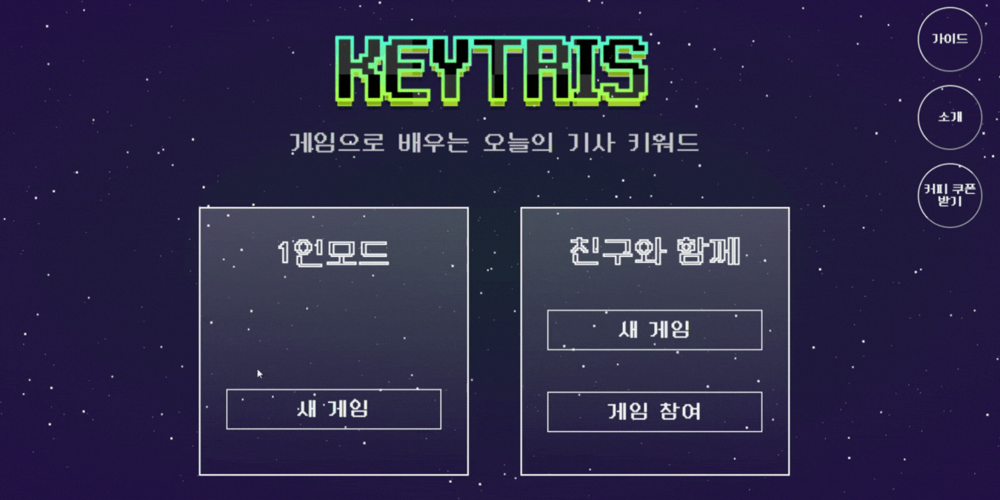
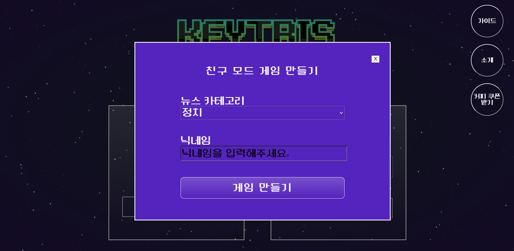

# About KEYTRIS

- 게임으로 배우는 오늘의 기사 키워드 KEYTRIS
- 단어 유사도를 활용해 오늘의 기사 키워드를 익히는 웹소켓 게임 서비스
- 개발 기간: 2023.08.14~2023.10.06

 

# Description

- KEYTRIS는 Keyword + Tetris의 합성어로 단어 유사도를 활용하여 오늘의 기사 키워드를 재미있게 배울 수 있는 게임입니다.
- 타겟어와 유사한 단어를 입력하여 화면에 쌓이는 단어 블럭을 없애고 점수를 획득할 수 있습니다.
- 싱글 모드 일일 랭킹 시스템을 제공하여 다른 플레이어와 경쟁하고 랭킹을 갱신하는 즐거움을 느낄 수 있습니다.
- 멀티 모드를 통해 친구들과 함께 게임을 즐길 수 있습니다.
- 뉴스 카테고리별로 매일 새로운 단어를 익히고, 게임에 등장한 타겟어가 포함된 기사를 확인할 수 있습니다.

 

# Main Features

1. Cron과 BeautifulSoup를 사용한 웹 크롤링 자동화

2. Hadoop과 Spark를 활용한 데이터 전처리 분산

3. SparkML라이브러리를 이용한 Word2Vec모델, Tf-idf모델 분산학습
- Spark 분산 클러스터를 통한 학습 속도 37.5% 단축 (4시간 -> 2.5시간)

4. Web Sockect, STOMP를 통한 멀티 플레이 게임 제공

5. Redis를 이용한 랭킹 시스템 제공

### System Architecture

### Data Pipeline

  

# Game Rules

### 1. 연두색 타겟어와 맥락이 유사한 새로운 단어를 입력해주세요.

### 2. 화면의 단어들이 입력 단어와 가장 유사한 순으로 정렬됩니다.

### 3. 타겟어가 4위 이내에 들어오면 단어가 제거되고 점수를 얻을 수 있어요.

### 4. 3초마다 새로운 단어가 화면에 추가됩니다. 최상단까지 단어가 쌓이면 게임이 종료되니, 빠르게 단어를 제거해보세요.

 

# Screens

## 게임 시작

### 1인 모드, 친구 모드 선택 가능

### 뉴스 카테고리 선택
- 알고 싶은 기사 카테고리를 선택하는 기능 (정치, 경제, 사회, 생활/문화, 세계, IT/과학)

## 1인 모드

### 매일 새로운 기사에서 추출된 단어로 1인 게임 가능
- 3초마다 새로운 단어 추가
- 게임 난이도 조절을 위해 입력 제한 단어 설정

## 친구 모드

### 최대 4명이 함께 게임 가능 

### 친구 모드 게임 만들기

### 게임 초대하기
- 게임 코드를 복사하여 친구 초대

### 게임 입장하기

### 채팅
- 참여자 입장 알림, 참여자 간 채팅 기능

### 참여자 순위 확인
- 함께한 플레이어, 나의 순위 확인 가능

  

# Service ENV

- Hadoop 3.3.1
- Spark 3.4.1
- Python 3.8
- FastAPI 0.103.1
- Java 11
- Spring Boot 2.7.15
- Redis 7.0.12
- Node.js 18.16
- Ubuntu 20.04 

# Tools

- Gitlab
  - git-flow 전략으로 branch 관리
  - 코드 버전 관리
  - 자동배포 (develop to master)
- JIRA
  - 매주 총 40시간의 Sprint를 진행하며 스케줄 관리
- Notion
  - 회의록 보관
  - 스프린트 회고 진행
  - API 명세서 작성 
  - 컨벤션 정리
  - 기술 이슈 정리
  - 산출물 및 공통 문서 관리
- Figma
  - 와이어프레임 및 디자인

 

# Stacks

### DATA

### BE

### FE

### INFRA

 

# Reference
- [semantris](https://research.google.com/semantris)
- word2vec
- tf-idf
- [Neo둥근모Pro](https://neodgm.dalgona.dev/downloads/neodgm_pro.html)

  

# Project Outputs

- [기능명세서](https://docs.google.com/spreadsheets/d/1BR-DWGsAMyqVNOeniKd2P5rJoGu8SHdreWt-hnOrL1k/edit#gid=675524623)
- [WireFrame & Design](https://www.figma.com/file/fa43d0QJNZGATiRjkrMYcO/%EC%99%80%EC%9D%B4%EC%96%B4%ED%94%84%EB%A0%88%EC%9E%84%2F%EB%94%94%EC%9E%90%EC%9D%B8?type=design&node-id=0%3A1&mode=design&t=CDgzBNAtJLEz0GGB-1)

 

# Members

- [김지수](https://github.com/jis002)(PM, BE, FE)
- [김종원](https://github.com/jkjongwon)(BE, FE)
- [최지원](https://github.com/geewon07)(DATA, FE)
- [오정빈](https://github.com/GardenJB)(DATA, FE)
- [김재현](https://github.com/JaeHyoNi)(DATA, INFRA)
- [김영도](https://github.com/yimo22)(INFRA)

